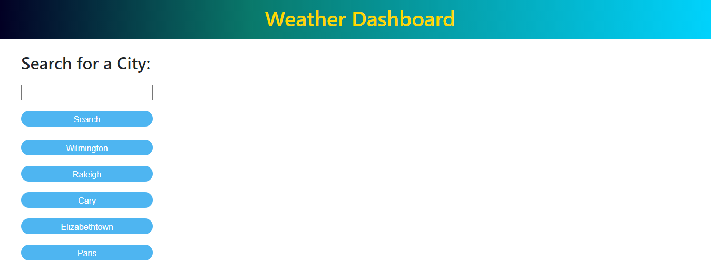
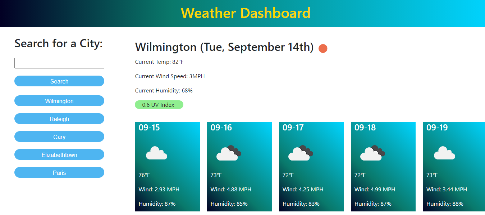

# Homework Week 6 Weather Dashboard

The goal of this homework was to create a page that takes a user input for a city and then displays the current weather and 5 day forecast for the entered city. 

## Instructions for use

On the initial load of the page the application will check local storage for prior city searches. If the application has been used before the page will render buttons under the search button for quick access to weather information from prior searches. If the application has never been used before simply enter a desired city to check the weather. If the city cannot be found you will be met with an error stating that the city was unable to be loaded and will request another city input. 

## Notes

If you would like to remove the previous searches type "clear" into the search bar and the page will reload with no previous searches. Also if you type a city in that has been searched before a duplicate button will be rendered in the list of previous searches. 

Also this app was developed using a deprecated api call from open weather which explains some of the messy javascript in terms of rendering the forecast. While I would have liked to use the most current api call to display all information, I simply did not have enough time to rewrite the code. 

## Screenshots

The following images demonstrate the web applications apperance and functionality:

## Link to deployed application 

[Link to deployed application via Github Pages](https://zmoore371.github.io/Homework-Week-6)

[Follow this link to access the applications repository](https://github.com/zmoore371/Homework-Week-6) 